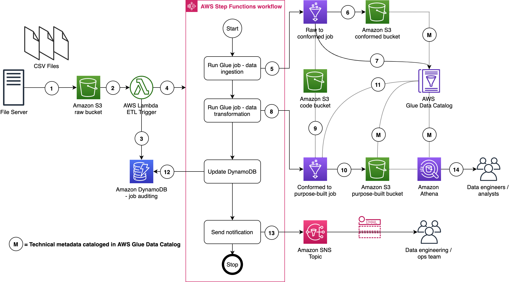
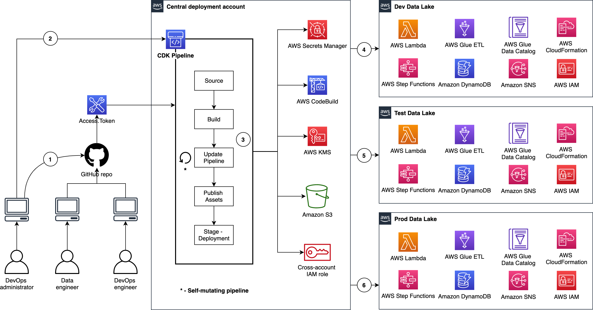

# CDK Pipelines for Data Lake ETL Deployment

This solution helps you deploy ETL processes on data lake using [AWS CDK Pipelines](https://docs.aws.amazon.com/cdk/latest/guide/cdk_pipeline.html). This is based on AWS blog [Deploy data lake ETL jobs using CDK Pipelines](https://aws.amazon.com/blogs/devops/deploying-data-lake-etl-jobs-using-cdk-pipelines/). We recommend you to read the blog before you proceed with the solution.

[CDK Pipelines](https://docs.aws.amazon.com/cdk/api/latest/docs/pipelines-readme.html) is a construct library module for painless continuous delivery of CDK applications. CDK stands for Cloud Development Kit. It is an open source software development framework to define your cloud application resources using familiar programming languages.

This solution helps you to:

1. deploy ETL jobs on data lake
1. build CDK applications for your ETL workloads
1. deploy ETL jobs from a central deployment account to multiple AWS environments such as dev, test, and prod
1. leverage the benefit of self-mutating feature of CDK Pipelines. For example, whenever you check your CDK app's source code in to your version control system, CDK Pipelines can automatically build, test, and deploy your new version
1. increase the speed of prototyping, testing, and deployment of new ETL jobs

---

## Contents

* [Data lake](#data-lake)
  * [Architecture](#architecture)
  * [Infrastructure](#infrastructure)
  * [ETL use case](#etl-use-case)
* [The solution](#the-solution)
  * [Centralized deployment](#centralized-deployment)
  * [Continuous delivery of ETL jobs using CDK Pipelines](#continuous-delivery-of-etl-jobs-using-cdk-pipelines)
  * [Source code structure](#source-code-structure)
* [Deployment](#deployment)
  * [Setup infrastructure and bootstrap AWS accounts](#setup-infrastructure-and-bootstrap-aws-accounts)
  * [Deploying for the first time](#deploying-for-the-first-time)
  * [Iterative Deployment](#iterative-deployment)
* [Additional resources](#additional-resources)
  * [Clean up](#clean-up)
  * [AWS CDK](#aws-cdk)
  * [Developer guide](#developer-guide)
* [Authors](#authors)
* [License Summary](#license-summary)

## Data lake

In this section we talk about Data lake architecture and its infrastructure.

---

### Architecture

To level set, let us design a data lake. As shown in the figure below, we use Amazon S3 for storage. We use three S3 buckets - 1) raw bucket to store raw data in its original format 2) conformed bucket to store the data that meets the quality requirements of the lake 3) purpose-built data that is used by analysts and data consumers of the lake.

The Data Lake has one producer which ingests files into the raw bucket. We use AWS Lambda and AWS Step Functions for orchestration and scheduling of ETL workloads.

We use AWS Glue for ETL and data cataloging, Amazon Athena for interactive queries and analysis. We use various AWS services for logging, monitoring, security, authentication, authorization, notification, build, and deployment.

**Note:** [AWS Lake Formation](https://aws.amazon.com/lake-formation/) is a service that makes it easy to set up a secure data lake in days. [Amazon QuickSight](https://aws.amazon.com/quicksight/) is a scalable, serverless, embeddable, machine learning-powered business intelligence (BI) service built for the cloud. These two services are not used in this solution.


---

### Infrastructure

Now we have the Data Lake design, let's deploy its infrastructure. You can use [AWS CDK Pipelines for Data Lake Infrastructure Deployment](https://github.com/aws-samples/aws-cdk-pipelines-datalake-infrastructure) for this purpose.

---

### ETL use case

To demonstrate the above benefits, we will use [NYC Taxi and Limousine Commission Data](https://www1.nyc.gov/site/tlc/about/tlc-trip-record-data.page) and build a sample ETL process for this. In our Data Lake, we have three S3 buckets - Raw, Conformed, and Purpose-built.

Figure below represents the infrastructure resources we provision for Data Lake.

1. A file server uploads files to S3 raw bucket of the data lake. Here file server is a data producer/source for the data lake. Assumption is the data will be pushed to the raw bucket
1. Amazon S3 triggers an event notification to AWS Lambda Function
1. AWS Lambda function inserts an item in DynamoDB table
1. AWS Lambda function Starts an execution of AWS Step Functions State machine
1. Runs a Glue Job – Initiate glue job in sync mode
1. Glue job – Spark glue job will process the data from raw to conform. Source data is provided in csv format and will be converted to the parquet format
1. After creating parquet data will update the Glue Data Catalog table
1. Runs a Glue Job – initiates data processing from conform to purpose-built in sync mode
1. Glue Job – conformed to purpose-built fetches data transformation rules from DynamoDB table 
1. Stores the result in parquet format within purpose-built zone
1. Glue job updates the Data Catalog table
1. Updates DynamoDB table with job status
1. Sends SNS notification
1. Data engineers or analysts analyze data using Amazon Athena




---

## The solution

We use a centralized deployment model to deploy data lake infrastructure across dev, test, and prod environments.

---

### Centralized deployment

Let us see how we deploy data lake ETL workloads from a central deployment account to multiple AWS environments such as dev, test, and prod. As shown in the figure below, we organize **Data Lake ETL source code** into three branches - dev, test, and production. We use a dedicated AWS account to create CDK Pipelines. Each branch is mapped to a CDK pipeline and it turn mapped to a target environment. This way, code changes made to the branches are deployed iteratively to their respective target environment.


---

## Continuous delivery of ETL jobs using CDK Pipelines

Figure below illustrates the continuous delivery of ETL jobs on Data Lake.



There are few interesting details to point out here:

1. The DevOps administrator checks in the code to the repository.
1. The DevOps administrator (with elevated access) facilitates a one-time manual deployment on a target environment. Elevated access includes administrative privileges on the central deployment account and target AWS environments.
1. CodePipeline periodically listens to commit events on the source code repositories. This is the self-mutating nature of CodePipeline. It’s configured to work with and is able to update itself according to the provided definition.
1. Code changes made to the main branch of the repo are automatically deployed to the dev environment of the data lake.
1. Code changes to the test branch of the repo are automatically deployed to the test environment.
1. Code changes to the prod branch of the repo are automatically deployed to the prod environment.

---

### Source code structure

Table below explains how this source ode structured:

  | File / Folder    | Description  |
  |------------------| -------------|
  | [app.py](app.py) | Application entry point |
  | [pipeline_stack](lib/pipeline_stack.py) | Pipeline stack entry point |
  | [pipeline_deploy_stage](lib/pipeline_deploy_stage.py) | Pipeline deploy stage entry point |
  | [glue_stack](lib/glue_stack.py) | Stack creates Glue Jobs and supporting resources such as Connections, S3 Buckets - script and temporary - and an IAM execution Role |
  | [step_functions_stack](lib/step_functions_stack.py) | Stack creates an ETL State machine which invokes Glue Jobs and supporting Lambdas - state machine trigger and status notification. |
  | [dynamodb_stack](lib/dynamodb_stack.py) | Stack creates DynamoDB Tables for Job Auditing and ETL transformation rules. |
  | [Glue Scripts](lib/glue_scripts) | Glue spark job data processing logic for conform and purpose built layers |
  | [ETL Job Auditor](lib/etl_job_auditor/lambda_handler.py) | lambda script to update dynamodb in case of glue job success or failure |
  | [ETL Trigger](lib/state_machine_trigger/lambda_handler.py) | lambda script to trigger step function and initiate dynamodb |
  | [ETL Transformation SQL](lib/glue_scripts/transformation-sql) | Transformation logic to be used for data processing from conformed to purpose-built |
  | [Resources](./resources) | This folder has architecture and process flow diagrams |

---

## Deployment

This section provides deployment instructions.

---

### Setup infrastructure and bootstrap AWS accounts

This project is dependent on the [AWS CDK Pipelines for Data Lake Infrastructure Deployment](https://github.com/aws-samples/aws-cdk-pipelines-datalake-infrastructure). Please reference the [Prerequisites section in README](https://github.com/aws-samples/aws-cdk-pipelines-datalake-infrastructure#prerequisites).

### Deploying for the first time

Configure your AWS profile to target the central Deployment account as an Administrator and perform the following steps:

1. Open command line (terminal)
1. Go to project root directory where ```cdk.json``` and ```app.py``` exist
1. Run the command ```cdk ls```
1. Expected output. You will see the following CloudFormation stack names listed on your terminal

   ```bash
   DevDataLakeCDKBlogEtlPipeline
   ProdDataLakeCDKBlogEtlPipeline
   TestDataLakeCDKBlogEtlPipeline
   DevDataLakeCDKBlogEtlPipeline/Dev/DevDataLakeCDKBlogEtlDynamoDb
   DevDataLakeCDKBlogEtlPipeline/Dev/DevDataLakeCDKBlogEtlGlue
   DevDataLakeCDKBlogEtlPipeline/Dev/DevDataLakeCDKBlogEtlStepFunctions
   ProdDataLakeCDKBlogEtlPipeline/Prod/ProdDataLakeCDKBlogEtlDynamoDb
   ProdDataLakeCDKBlogEtlPipeline/Prod/ProdDataLakeCDKBlogEtlGlue
   ProdDataLakeCDKBlogEtlPipeline/Prod/ProdDataLakeCDKBlogEtlStepFunctions
   TestDataLakeCDKBlogEtlPipeline/Test/TestDataLakeCDKBlogEtlDynamoDb
   TestDataLakeCDKBlogEtlPipeline/Test/TestDataLakeCDKBlogEtlGlue
   TestDataLakeCDKBlogEtlPipeline/Test/TestDataLakeCDKBlogEtlStepFunctions
   ```

1. Before you bootstrap central deployment account account, set environment variable

   ```bash
   export AWS_PROFILE=replace_it_with_deployment_account_profile_name_b4_running
   ```

1. Run the command ```cdk deploy --all```
1. Expected outputs:

    1. In deployment account, the following CodePipelines created successfully

       

    1. In Dev environment's CloudFormation console, the following stacks created successfully

       

---

### Iterative Deployment

Pipeline you have created using CDK Pipelines module is self mutating. That means, code checked to GitHub repository branch will kick off CDK Pipeline mapped to that branch.

---

## Testing

This section provides testing instructions.

---

### Prerequisites

Below lists steps are required before starting the job testing:

1. **Note:** We use [New York City TLC Trip Record Data.](https://www1.nyc.gov/site/tlc/about/tlc-trip-record-data.page)

1. Download Yellow Taxi Trip Records for [August-2020](https://nyc-tlc.s3.amazonaws.com/trip+data/yellow_tripdata_2020-08.csv)

1. Make sure the transformation logic is entered in dynamodb for <> table. As part of job creation mentioned transformation logic will be used to transform data from raw to conform:

   ```sql
   SELECT count(*) count, coalesce(vendorid,-1) vendorid, day, month, year, pulocationid, dolocationid, payment_type, sum(passenger_count) passenger_count, sum(trip_distance) total_trip_distance, sum(fare_amount) total_fare_amount, sum(extra) total_extra, sum(tip_amount) total_tip_amount, sum(tolls_amount) total_tolls_amount, sum(total_amount) total_amount
   FROM datalake_raw_source.yellow_taxi_trip_record
   GROUP BY vendorid, day, month, year, day, month, year, pulocationid, dolocationid, payment_type;
   ```

1. Create a folder under raw bucket `{target_environment.lower()}-{resource_name_prefix}-{self.account}-{self.region}-raw` root path, this folder name will be used as source_system_name. You can use `tlc_taxi_data` or name of your choice.

1. Go to the created folder and create child folder named `yellow_taxi_trip_record` or you can name it per your choice

1. Configure Athena workgroup before you run queries via Amazon Athena. For more details, refer [Setting up Athena Workgroups](https://docs.aws.amazon.com/athena/latest/ug/workgroups-procedure.html).

---

### Steps for ETL testing

1. Go to raw S3 bucket and perform the following steps:
    1. create a folder with name ```tlc_taxi_data``` and go to it
    1. create a folder with name ```yellow_taxi_trip_record``` and go to it
    1. upload the file `yellow_tripdata_2020-01.csv`

1. Upon successful load of file S3 event notification will trigger the lambda

1. Lambda will insert record into the dynamodb table `{target_environment.lower()}-{resource_name_prefix}-etl-job-audit` to track job start status

1. Lambda function will trigger the step function. Step function name will be `<filename>-<YYYYMMDDHHMMSSxxxxxx>` and provided the required metadata input

1. Step functions state machine will trigger the Glue job for Raw to Conformed data processing.

1. Glue job will load the data into conformed bucket using the provided metadata and data will be loaded to `s3://{target_environment.lower()}-{resource_name_prefix}-{self.account}-{self.region}-conformed/tlc_taxi_data/yellow_taxi_trip_record/year=YYYY/month=MM/day=DD` in parquet format

1. Glue job will create/update the catalog table using the tablename passed as parameter based on folder name `yellow_taxi_trip_record` as being mentioned in prerequisites

1. After raw to conform job completion purpose-built glue job will get triggered in step function

1. Purpose built glue job will use the transformation logic being provided in dynamodb as part of prerequisites for data transformation

1. Purpose built glue job will store the result set in S3 bucket under `s3://{target_environment.lower()}-{resource_name_prefix}-{self.account}-{self.region}-purposebuilt/tlc_taxi_data/yellow_taxi_trip_record/year=YYYY/month=MM/day=DD`

1. Purpose built glue job will create/update the catalog table

1. After completion of glue job lambda will get triggered in step function to update the dynamodb table `{target_environment.lower()}-{resource_name_prefix}-etl-job-audit` with latest status

1. SNS notification will be sent to the subscribed users

1. To validate the data, please open Athena service and execute query. For testing purpose below mentioned query is being used 

   ```sql
   SELECT * FROM "datablog_arg"."yellow_taxi_trip_record" limit 10;
   ```

1. For testing of `second data source`, Download Green Taxi Trip Records for [August-2020](https://nyc-tlc.s3.amazonaws.com/trip+data/green_tripdata_2020-08.csv)

1. Perform the prerequisites for second source, where create child folder `yellow_taxi_trip_record` under could be `tlc_taxi_data` in `s3://{target_environment.lower()}-{resource_name_prefix}-{self.account}-{self.region}-raw`

1. For dynamodb transformation logic you can use the below mentioned query:

   ```sql
   SELECT count(*) count, coalesce(vendorid,-1) vendorid, day, month, year, pulocationid, dolocationid, payment_type, sum(passenger_count) passenger_count, sum(trip_distance) total_trip_distance, sum(fare_amount) total_fare_amount, sum(extra) total_extra, sum(tip_amount) total_tip_amount, sum(tolls_amount) total_tolls_amount, sum(total_amount) total_amount
   FROM datalake_raw_source.green_taxi_record_data
   GROUP BY vendorid, day, month, year, day, month, year, pulocationid, dolocationid, payment_type
   ```

---

## Additional resources

In this section, we provide some additional resources.

---

### Clean up

1. Delete stacks using the command ```cdk destroy --all```. When you see the following text, enter **y**, and press enter/return.

   ```bash
   Are you sure you want to delete: TestDataLakeCDKBlogEtlPipeline, ProdDataLakeCDKBlogEtlPipeline, DevDataLakeCDKBlogEtlPipeline (y/n)?
   ```

   Note: This operation deletes stacks only in central deployment account

1. To delete stacks in **development** account, log onto Dev account, go to AWS CloudFormation console and delete the following stacks:

   1. Dev-DevDataLakeCDKBlogEtlDynamoDb
   1. Dev-DevDataLakeCDKBlogEtlGlue
   1. Dev-DevDataLakeCDKBlogEtlStepFunctions

1. To delete stacks in **test** account, log onto Dev account, go to AWS CloudFormation console and delete the following stacks:

   1. Test-TestDataLakeCDKBlogEtlDynamoDb
   1. Test-TestDataLakeCDKBlogEtlGlue
   1. Test-TestDataLakeCDKBlogEtlStepFunctions

1. To delete stacks in **prod** account, log onto Dev account, go to AWS CloudFormation console and delete the following stacks:

   1. Prod-ProdDataLakeCDKBlogEtlDynamoDb
   1. Prod-ProdDataLakeCDKBlogEtlGlue
   1. Prod-ProdDataLakeCDKBlogEtlStepFunctions

1. For more details refer to [AWS CDK Toolkit](https://docs.aws.amazon.com/cdk/latest/guide/cli.html)

---

### AWS CDK

Refer to [cdk_instructions.md](./resources/cdk_instructions.md) for detailed instructions

---

### Developer guide

Refer to [Developer Guide](resources/developer_guide.md) for more information on this project

---

## Authors

The following people are involved in the design, architecture, development, and testing of this solution:

1. **Isaiah Grant**, Cloud Consultant, 2nd Watch, Inc.
1. **Muhammad Zahid Ali**, Data Architect, Amazon Web Services
1. **Ravi Itha**, Senior Data Architect, Amazon Web Services

---

## License Summary

This sample code is made available under the MIT-0 license. See the LICENSE file.
